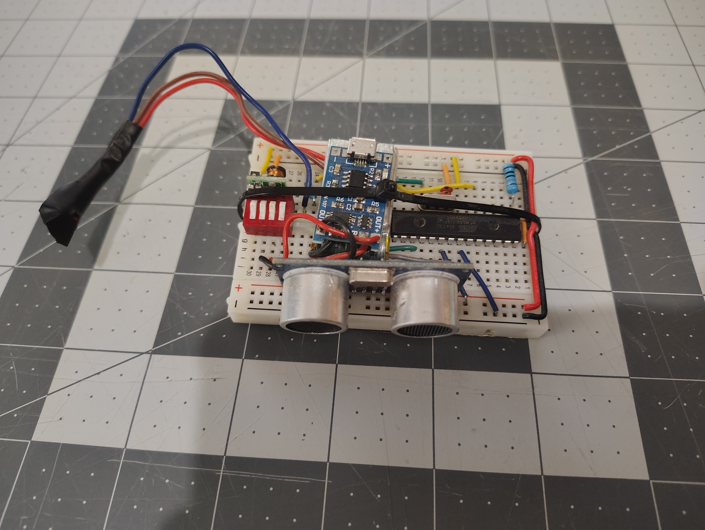

# VR-Collision-Avoidance-Sensor

This README describes the TARGET STATE of this repo.  The project as described is completed, but the documentation proccess is ongoing.  Until this message is removed, docouments listed as components of the repo may bve missing or otherwise missaligned.

## Overview
This repository documents the design and development of an embedded device intended to help VR users avoid physical collisions while immersed in virtual environments.

The project began as an Arduino-based prototype used to validate the core concept and functionality. It was then redesigned around the standalone ATmega328P microcontroller on a breadboard to explore a more integrated embedded implementation. The final iteration moved to a custom PCB design, creating a compact hardware platform suitable for further refinement toward a production-ready device.

The repository contains three documented development stages:

  - Arduino Prototype: Rapid proof-of-concept development using the Arduino platform
  - ATmega328P Breadboard Version: Standalone microcontroller implementation with custom firmware and supporting circuitry
  - Custom PCB Version: Dedicated hardware design including schematics, PCB layout, and final firmware

Each stage includes hardware documentation, firmware, design decisions, and lessons learned throughout the development process.

## Key Features
- Based on ATmega328P using 
- HC-SR04 Ultrasound distance sensor to sense distance to obsticals
- LED and speaker output alerts user
- Final Version has on-board Li-on battery with HW-107 charging module

## Architecture Diagram
```text
VR-Collision-Avoidance-Sensor/
│
├── README.md
├── LICENSE
├── .gitignore
├── arduino_version/
│   ├── README.md
│   ├── src/
│   │   └── Wall_Sensor_0.1.3.ino
│   │   │
│   └── hardware/
│       ├── Circut_Map.png
│       └── bom.csv
│
├── atmega_breadboard_version/
│   ├── README.md
│   ├── firmware/
│   │   └── BattleBuddy_S_0.1.ino
│   │
│   └── hardware/
│       └── bom.csv
│   
│
└── pcb_version/
    ├── README.md
    ├── firmware/
    │   └── Wall_Sensor_0.2.0
    │   │
    ├── hardware/
    │   ├── schematics.pdf
    │   ├── pcb_layout.kicad_pcb (or Eagle files)
    │   └── bom.csv
    │   │
    └── images/
        ├── parts.png
        ├── assembled2.png
        └── assembled1.png
 ```


## Project Stages

See each stage's README for details:

- Arduino Prototype:  `arduino_version\README.md`

- Breadboard Bare-Metal Implementation:  `atmega_breadboard_version\README.md`

- PCB Production Prototype Version:  `pcb_version\README.md`
