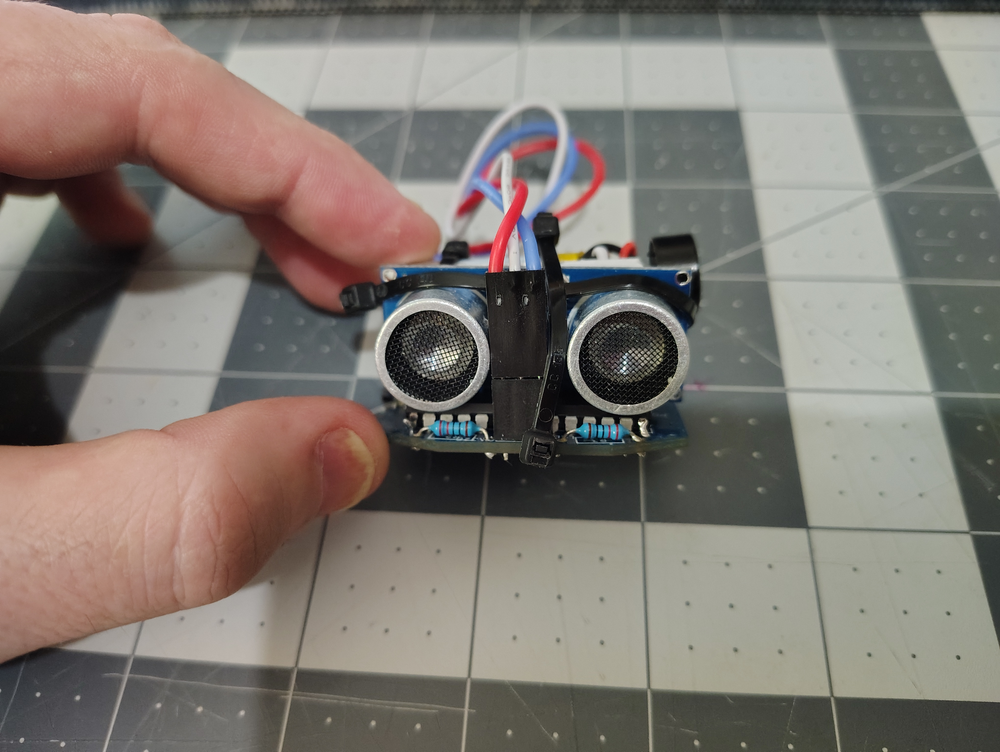

# Atmega-Breadboard Wall Sensor - "Wall Sensor 0.2"



## Purpose

Build on previous work to create an improved embedded prototype for preventing physical collisions while using VR headsets.

This prototype combines the lessons learned from the Battle Buddy prototype by adding a more complete warning system:

- Visual distance indication using RGB LED feedback
- Audible proximity warning
- Embedded microcontroller design
- Battery-powered operation

This version validates the combined feedback system and transitions to a custom PCB implementation.

---

## Architecture

- Ultrasonic sensor module (HC-SR04) to measure distance
- RGB LED to provide visual feedback based on object proximity
- Piezoelectric buzzer to provide audible proximity warnings
- Atmega328P microcontroller for logic and control
- Li-ion battery for wireless operation
- HW-107 Battery Management Module for charging
- Boost converter to provide regulated 5V operation

The warning system converts distance measurements into a warning intensity value:

- Far distance:
  - Blue LED indication
  - No buzzer

- Medium distance:
  - Color transitions toward red
  - Intermittent warning tone

- Close distance:
  - Red LED indication
  - Maximum warning intensity

---

## Hardware

### Components

| Item | Qty | Reference | Value | Description | Part Number |
|:---|:---:|:---:|:---:|:---|:---|
| 1 | 1 | U1 | | Microcontroller | Atmega328P |
| 2 | 1 | X1 | | Piezoelectric Oscillator | |
| 3 | 2 | C1 C2 | 22 pF | Ceramic Capacitor | |
| 4 | 1 | HC-SR04 | | Ultrasonic Sensor | HC-SR04 |
| 5 | 1 | R1 | 10K Ohms | Resistor | |
| 6 | 1 | D1 | 5V | RGB LED | |
| 7 | 2 | R2 R3 | 220 Ohms | Current-Limiting Resistor | |
| 8 | 1 | PCB | | Custom PCB | |
| 9 | 1 | Boost | 3V to 5V | Boost Converter | |
| 10 | 1 | S1 | | Power Switch | |
| 11 | 1 | HW-107 | | Battery Management Module | HW-107 |
| 12 | 1 | B1 | 3.7V 300 mAh | Li-ion Battery | |
| 13 | 2 | J1 J2 | 2.54mm 2x1 | Header Pins | |
| 14 | 1 | J3 | 2.54mm 3x1 | Header Pins | |
| 15 | 1 | | 2.54mm 2x1 | Male Dupont Connector with Pins | |
| 16 | 1 | | 2.54mm 3x1 | Male Dupont Connector with Pins | |

---

### Hardware Documentation

- Circuit diagram: `hardware/Circuit_Map.png`
- Bill of materials: `hardware/BOM.csv`
- Image of materials: `images/parts-staged.jpg`

---

## Software

The Arduino firmware:

- Runs startup LED sequence to indicate operation
- Reads distance measurements from the HC-SR04 sensor
- Converts measured distance into warning intensity
- Controls RGB LED color and brightness
- Activates buzzer warning based on proximity

Firmware location:  ```firmware/Wall_Sensor_0.2.0/Wall_Sensor_0.2.0.ino```


---

## Design Notes

This version combines the visual feedback concepts explored in Battle Buddy with the warning behavior from the original Wall Sensor prototype.

Changes:

- Uses bare Atmega328P microcontroller instead of Arduino UNO R3
- Adds battery operation with USB charging
- Reintroduces audible warnings for improved situational awareness
- Replaces simple LED indication with RGB distance feedback
- Uses warning intensity as a shared value for multiple output systems

The warning intensity model allows the system to scale naturally:

```
Distance
|
v
Warning Intensity
|
+--> RGB LED
|
+--> Buzzer
```


---

## Limitations

- Detection is limited to a single ultrasonic sensor direction
- Sensor placement and field-of-view limit detection coverage
- LED indication through VR headset optics is functional but not optimized
- Needs a proper enclosure and attatchment mechanism

---

## Lessons Learned

This prototype validated:

- RGB visual feedback provides better distance awareness than simple alarms
- Combining visual and audible feedback improves user awareness
- Bare microcontroller design works for a wearable embedded device
- The design direction is suitable for continued development toward a custom PCB implementation
- The LED used was too small, leading to a structural failure of the solder joints.  Need a better design, oir more skilled solder opperator.